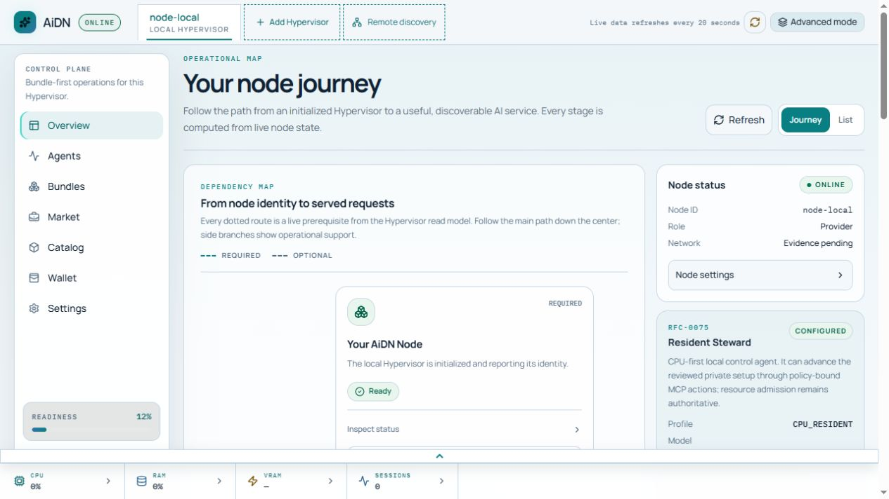
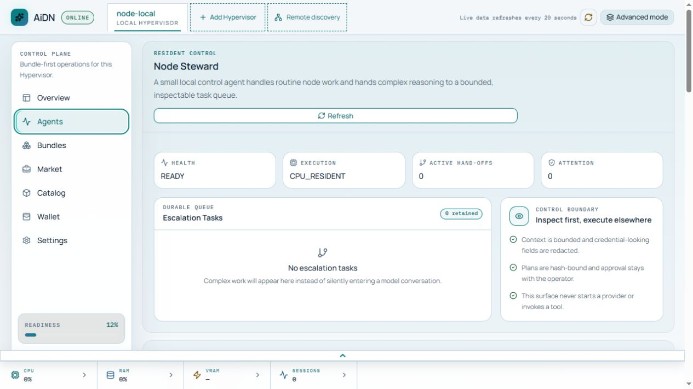

# AiDN Hypervisor

<p align="center">
  <strong>Управляйте AI-вычислениями как нодой — от локального Runtime до проверяемого сетевого сервиса.</strong>
</p>

<p align="center">
  <a href="https://github.com/glinko/AiDN/actions/workflows/ci.yml"></a>
  <a href="LICENSE"></a>
  <a href="pyproject.toml"></a>
</p>

<p align="center"><strong>Язык:</strong> <a href="README.md">English</a> · Русский</p>

> Английский [README](README.md) — канонический исходник. При изменении
> функциональности сначала обновляется он, затем этот перевод.

AiDN — операторский control plane для AI-ресурсов. **AiDN Hypervisor**
объединяет проверенные Providers исполнения, модели, неизменяемые Bundles,
Endpoint-предложения, учёт через Wallet, evidence валидации и сетевые операции,
сохраняя отдельные границы владения для каждого объекта.

Он нужен оператору, который хочет превратить машину в полезную AI-ноду и при
этом понимать, что запущено, за что взимается оплата и какие действия требуют
явного подтверждения.

> **Статус проекта:** активная разработка и подготовка testnet. Поддерживаемый
> Ubuntu bootstrap безопасен по умолчанию: API доступен только на loopback,
> firewall-порты не открываются, а Wallet, Endpoint и peer-соединение не
> публикуются автоматически.

## Содержание

- [Возможности](#возможности)
- [Dashboard](#dashboard)
- [Для операторов](#для-операторов)
- [Для разработчиков](#для-разработчиков)
- [Архитектура](#архитектура)
- [Документация](#документация)
- [Безопасность](#безопасность)
- [Лицензия](#лицензия)

## Возможности

| Зона ответственности | Граница AiDN |
| --- | --- |
| **Вычисления** | Подключайте проверенный Provider, материализуйте модель и допускайте Runtime-работу через Resource Broker. |
| **Развёртывание** | Создавайте неизменяемый Bundle, связывающий Provider, модель, Runtime, конфигурацию и ресурсную политику. |
| **Сервис** | Публикуйте отдельное Endpoint-предложение только после readiness- и validation-gates. |
| **Расчёты** | Используйте Wallet и пополняемый escrow-депозит для явного metered-учёта Sessions. |
| **Сеть** | Выполняйте CometBFT-aware операции ноды, peer discovery, репликацию и validation, не выдавая локальное состояние за глобальную истину. |
| **Управление** | Инспектируйте ноду через Dashboard, CLI или scoped MCP-сервер; привилегированные действия остаются policy- и approval-bound. |

Работающий процесс ещё не является сетевым сервисом. AiDN делает видимым
каждый переход: identity ноды → Provider → модель → Bundle → Endpoint →
validation → discovery → обслуживаемые запросы.

## Dashboard

React Dashboard — живая карта этого пути. Basic Mode предназначен для обычной
настройки, а Advanced Mode открывает детальные поверхности Providers, Runtimes,
Resources, validation, network и automation.



<p align="center"><sub>Текущий React Dashboard, снятый с локально запущенного development Hypervisor. Это реальное development-состояние, а не синтетическое заявление о production.</sub></p>

Resident Steward — ограниченный локальный control agent, а не скрытый
автономный администратор. Он получает безопасный контекст ноды, объясняет
наблюдаемое состояние и передаёт действия через существующие границы approval
и Resource Broker.



<p align="center"><sub>Resident Steward: явные health, очередь и границы полномочий в текущем светлом интерфейсе.</sub></p>

## Для операторов

### Установка на чистый Ubuntu-хост

Поддерживаемый путь рассчитан на **Ubuntu 24.04+**. Для acceptance- или
production-развёртывания закрепляйте проверенный tag или commit; не запускайте
bootstrap с непроверенной подвижной ссылки.

```bash
curl --proto '=https' --tlsv1.2 -fsSL \
  https://raw.githubusercontent.com/glinko/AiDN/<reviewed-ref>/tools/aidn-operator-bootstrap-ubuntu.sh \
  | bash -s -- --ref <reviewed-ref>
```

Интерактивный bootstrap подготавливает checkout, постоянное операторское
состояние, зашифрованное локальное secret store, измерение возможностей хоста,
закреплённый CometBFT, user-level services и React Dashboard. В завершение он
выводит secret-free handoff report с URL сервисов и следующими шагами.

Для автоматизации с консервативными defaults:

```bash
curl --proto '=https' --tlsv1.2 -fsSL \
  https://raw.githubusercontent.com/glinko/AiDN/<reviewed-ref>/tools/aidn-operator-bootstrap-ubuntu.sh \
  | bash -s -- --ref <reviewed-ref> \
      --operator-id operator-example-1 --non-interactive
```

После установки React Dashboard доступен по адресу:

```text
http://127.0.0.1:8766/operators/dashboard/react
```

Listener по умолчанию локальный. Для trusted LAN включайте его явно в wizard
или по [release-package guide](docs/operations/operator-release-package.md);
не выставляйте HTTP API без аутентификации в публичный Интернет.

### Первый workflow оператора

1. Установите Hypervisor и откройте Dashboard из bootstrap handoff.
2. Привяжите браузер одноразовым кодом из installer или выполните
   `aidn-operator pair` для нового десятиминутного pairing code.
3. Создайте или импортируйте owner Wallet, если нужны сетевые действия и
   settlement.
4. Проверьте и установите Provider, затем выберите и материализуйте модель.
5. Создайте Bundle, подтвердите resource admission и запустите Runtime.
6. Подготовьте и провалидируйте Endpoint перед публикацией или discovery.

Полные инструкции: [Interactive Hypervisor installation](docs/operations/interactive-hypervisor-installation.md),
[Ubuntu Operator Release Package](docs/operations/operator-release-package.md)
и [операторские runbooks](docs/operations/).

### AI-assisted setup

Режим `ai_assisted` помогает выбрать Provider и модель в ограниченном
проверяемом workflow. Он может предварительно скачать pinned model artifact,
но не устанавливает непроверенное ПО, не создаёт Wallet, не резервирует
ресурсы, не публикует Endpoint и не обходит операторское approval.

Подробности — в [гайде по assisted installation](docs/operations/interactive-hypervisor-installation.md):
каталог моделей, resource estimates, integrity checks и handoff.

## Для разработчиков

### Локальная настройка

AiDN использует [uv](https://docs.astral.sh/uv/) для воспроизводимых Python
окружений. Требуется Python **3.11+**.

```bash
git clone https://github.com/glinko/AiDN.git
cd AiDN
uv sync --all-extras
uv run pytest -q
```

`uv.lock` фиксирует dependency resolution для локальной разработки и CI. После
изменения `pyproject.toml` обновите его с `uv lock` и проверьте:

```bash
uv sync --all-extras --frozen
```

### Запуск API локально

```bash
uv run uvicorn aidn_hypervisor.main:build_app --factory \
  --host 127.0.0.1 --port 8766
```

Откройте `http://127.0.0.1:8766/operators/dashboard/react` в браузере.
Исходный React-код находится в `web/operator-dashboard/`:

```bash
cd web/operator-dashboard
pnpm install
pnpm dev
```

### Полезные команды

```bash
# Операторский CLI
uv run aidn --help

# Статические проверки и hermetic suite
uv run ruff check src tests
uv run pytest -q

# Каталог документации и локальные ссылки
uv run python tools/generate-docs-index.py
uv run python tools/verify-docs-links.py
```

## Архитектура

```text
Оператор ── Dashboard / CLI / MCP ──► Hypervisor control plane
                                            │
                         ┌──────────────────┼──────────────────┐
                         ▼                  ▼                  ▼
                    Provider          Resource Broker       Wallet
                         │                  │                  │
                         ▼                  ▼                  ▼
                    Runtime ─────────► Bundle ───────────► Endpoint
                                                               │
                                                               ▼
                                                        Session + escrow
                                                               │
                                                               ▼
                                              Validation / registry / consensus
```

- **Provider** определяет, как исполняется модель.
- **Runtime** владеет живым исполняемым экземпляром и его admission lease.
- **Bundle** — неизменяемая, воспроизводимая единица развёртывания.
- **Endpoint** — предложение для потребителя, а не скрытая часть Bundle.
- **Session** фиксирует явный допуск запроса и metered settlement.
- **Ledger и consensus** определяют каноническое сетевое состояние; локальный
  UI не выдаёт нефинализированное наблюдение за finality.

Перед расширением этих границ прочитайте [Architecture](02_ARCHITECTURE.md) и
[Terms](01_TERMS.md).

## Документация

Начните с [каталога документации](docs/INDEX.md): он отделяет актуальные
продуктовые документы и operator procedures от implementation notes,
исторических планов и датированных acceptance evidence.

| Что нужно | С чего начать |
| --- | --- |
| Направление продукта и governance | [Vision](00_VISION.md) · [Roadmap](ROADMAP.md) |
| Контракты протокола и продукта | [Product & protocol authority](docs/INDEX.md#product-and-protocol-authority) |
| Установка и эксплуатация ноды | [Operations](docs/operations/) · [Operator release package](docs/operations/operator-release-package.md) |
| Network profile и участие в testnet | [RFC-0076](docs/product/RFC-0076-network-profile-and-network-configuration.md) · [RFC-0077](docs/product/RFC-0077-testnet-participation-incentive-protocol.md) |
| Границы control и agents | [MCP-0001](docs/product/MCP-0001-node-control-server-implementation-profile.md) · [RFC-0075](docs/product/RFC-0075-node-intelligence-architecture.md) |
| Provider и Runtime | [RFC-0053](docs/product/RFC-0053-capability-runtime-specification.md) · [RFC-0055](docs/product/RFC-0055-provider-plugin-system-and-directory.md) |
| Конфигурация | [TOML example](config/aidn.config.example.toml) · [parameter inventory](docs/configuration/hardcoded-parameters.md) |
| API | [WEB-0001 OpenAPI](docs/product/WEB-0001-website-api.openapi.yaml) |
| Правила ведения документации | [Documentation system](docs/DOCUMENTATION.md) |

## Безопасность

AiDN рассматривает эксплуатацию AI-ноды как задачу control plane, а не просто
как запуск модели.

- **Минимальная экспозиция по умолчанию.** Bootstrap использует loopback
  listeners и не меняет firewall policy.
- **Явные полномочия.** Wallet, peer trust, установка Provider, resource
  reservation, публикация Endpoint и сетевые изменения проходят отдельными
  проверяемыми путями.
- **Секреты остаются локальными.** Приватные ключи и зашифрованный secret-store
  material не возвращаются через Dashboard.
- **Автоматизация, связанная политикой.** Планы Steward, Dashboard и MCP
  allow-listed, hash-bound и остаются subject to operator approval.
- **Evidence до finality.** Сетевые и accounting flows различают локальное
  наблюдение, проверенное evidence и consensus-finalized state.

## Контроль качества

Каждый регулярный прогон CI проходит четыре этапа:

| Этап | Что проверяется | Блокирующий |
| --- | --- | --- |
| Static checks | Ruff и актуальность сгенерированной документации | Да |
| Tests | Hermetic test suite с coverage | Да |
| Package | Сборка wheel/sdist и изолированная установка wheel | Да |
| Integration | Реальные проверки Provider и сети | Только opt-in |

Ручной workflow release verification повторно запускает locked suite и
создаёт distribution artifacts с `SHA256SUMS`. Docker-backed multi-validator
CometBFT drills намеренно являются opt-in.

## Лицензия

AiDN распространяется по [Apache License 2.0](LICENSE).
