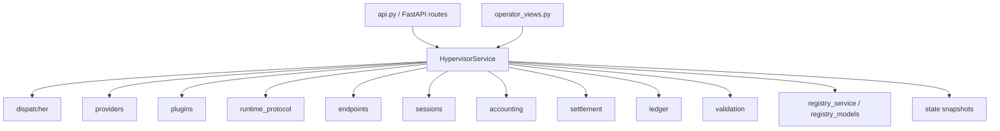

# Architecture Map, Refactor Plan, and CI Bootstrap

Date: 2026-07-22

This note captures the current implementation shape of the AiDN hypervisor repo,
the largest coupling hotspots, and the safest order for continued refactoring.

## Current Delivery Intent

The codebase is already past a toy bootstrap. The working MVP path now spans:

1. provider and runtime inventory,
2. endpoint creation and publication,
3. paid fixed-price session opening,
4. runtime execution and final usage evidence,
5. deterministic settlement and ledger recording,
6. operator-facing read models and dashboard workflows.

That means refactoring has to preserve two things at once:

- protocol and accounting invariants;
- operator-facing payload stability.

## Current Module Topology

## High-Coupling Hotspots

Largest modules by size:

- `src/aidn_hypervisor/service.py`
- `src/aidn_hypervisor/api.py`
- `src/aidn_hypervisor/registry_service.py`
- `src/aidn_hypervisor/providers/executor.py`
- `src/aidn_hypervisor/providers/service.py`
- `src/aidn_hypervisor/runtime_protocol/service.py`
- `src/aidn_hypervisor/validation/service.py`

Primary orchestration hotspot:

- `HypervisorService` is still the main integration spine for queueing, provider inventory, runtime routing, sessions, wallet/accounting hooks, settlement, registry projections, and operator read models.

This is not automatically wrong for an MVP, but it is now the main drag on:

- local reasoning;
- safe change sets;
- CI targeting;
- future remote/runtime/provider integration work.

## What Changed In This Slice

This slice introduces the first safe extraction:

- `src/aidn_hypervisor/operator_read_models.py`
- `src/aidn_hypervisor/provider_read_models.py`
- `src/aidn_hypervisor/session_read_models.py`
- `src/aidn_hypervisor/wallet_read_models.py`
- `src/aidn_hypervisor/endpoints/endpoint_application_service.py`
- `src/aidn_hypervisor/endpoints/mvp_session_application_service.py`
- `src/aidn_hypervisor/session_application_service.py`
- `src/aidn_hypervisor/mvp_session_economics_service.py`
- `src/aidn_hypervisor/wallet_economics_service.py`
- `src/aidn_hypervisor/wallet_allocation_service.py`
- `src/aidn_hypervisor/network_projection_service.py`
- `src/aidn_hypervisor/provider_installation_service.py`

It now owns the aggregation logic for:

- operator home payload;
- fleet payload;
- endpoints payload;
- requests payload.

The provider workspace payload has also been pulled out of `operator_views.py`
into a dedicated read-model module while keeping the existing wrapper function
and payload contract intact.

The operator session workspace payload has also been pulled out of `api.py`
into a dedicated read-model module, so API transport no longer owns session
aggregation and settlement-preview shaping directly.

Endpoint create/update/proxy attach-detach write flows now also delegate
through a dedicated endpoint application service instead of assembling
runtime-binding admission, onboarding refresh, validation supersede, and proxy
orchestration directly in route handlers.

MVP fixed-price session open, smoke, preview, finalize, and force-finalize
flows now also delegate through a dedicated session application service instead
of keeping settlement and runtime-evidence orchestration inside endpoint route
bodies.

Ordinary endpoint Session opening now also delegates through
`session_application_service.py`, so the endpoint router no longer assembles
accounting-contract resolution and session-open payloads inline.

The MVP fixed-price settlement and escrow orchestration inside
`HypervisorService` now also delegates through
`mvp_session_economics_service.py`, reducing one of the densest economic
clusters in `service.py` without changing the public API surface.

Wallet usage metering, faucet and epoch economics, wallet ledger/economics
exports, allocation finalization, allocation activation tracking, grace-window
reconciliation, and allocation dispute handling now also delegate through
`wallet_economics_service.py` and `wallet_allocation_service.py`, removing
another dense stateful slice from `HypervisorService` while preserving the
existing operator and API contracts.

Registry-facing node advertisement assembly, canonical overlay inventory,
publication/validation projection helpers, reputation evidence shaping, and
capability-catalog assembly now also delegate through
`network_projection_service.py`, removing another read-heavy slice from
`HypervisorService` without changing the published transport contract.

Provider installation approvals, provider-instance attachment, plugin-release
registration and installation, provider install diagnostics and jobs, and local
plugin-host listener orchestration now also delegate through
`provider_installation_service.py`, pulling another isolated management-plane
slice out of `HypervisorService` without touching the runtime/session write
path.

`HypervisorService` keeps the public methods, but now delegates to the read-model
service, so the external contract remains stable while orchestration shrinks.

## Refactor Principle

Refactor along read/write boundaries first, not by arbitrary file size.

Preferred order:

1. extract read models and projections;
2. extract protocol/application services with stable inputs and outputs;
3. move persistence helpers behind domain stores;
4. only then reduce orchestration in `HypervisorService`.

This avoids mixing:

- payload-shaping refactors;
- workflow refactors;
- protocol/economic rule changes.

## Safe Refactor Order

### Slice 1: Operator Read Models

Status:

- in progress, operator home/fleet/endpoints/requests, provider workspace, and
  session workspace extractions landed.
- wallet/economics drawer aggregation now also has a dedicated dashboard
  read-model payload, reducing the static operator UI from six wallet fetches
  to one compatibility-preserving aggregate request.
- validation summary, validation history, and validation snapshot compatibility
  expansion now also live in a dedicated read-model module instead of being
  assembled inline inside `api.py`.
- validation request/report/maintenance/epoch/publication/proof response
  shaping now also delegates through validation read-model helpers instead of
  being assembled inline inside `api.py`.
- operator endpoint validation-state shaping now also delegates through
  validation read-model helpers instead of calling validation summary methods
  directly from `operator_views.py`.
- MVP endpoint session/funding/settlement responses and generic session result
  payload shaping have started moving out of route bodies into dedicated helper
  modules, reducing duplicate response assembly across endpoint and operator
  session APIs.
- wallet endpoint publication list/export projections now delegate through
  wallet read-model helpers instead of assembling JSON arrays inside routes.
- session accounting, wallet ledger, ledger operation export, wallet economics,
  and faucet preview read surfaces now delegate through read-model helpers
  instead of calling service internals directly from route handlers.
- wallet usage/session/allocation list and export projections now also
  delegate through wallet read-model helpers instead of reaching directly into
  service exports from route handlers.
- endpoint write-side orchestration for create/update/proxy attach-detach now
  also lives outside the router.
- MVP session write-side orchestration for fixed-price economic flows now also
  lives outside the router.
- ordinary endpoint Session open now also lives outside the router.

Next candidates:

- validation operator dashboards and histories beyond endpoint-scoped API
  routes;
- settlement and ledger read models.

Target result:

- `operator_views.py` and API routes read from dedicated read-model services;
- `HypervisorService` exposes compatibility delegates only.

### Slice 2: Endpoint and Session Application Services

Extract application-level write flows from `HypervisorService` into dedicated
services with explicit command-style methods:

- endpoint draft/create/update/publish;
- fixed-price session open/finalize/force-finalize;
- proxy attach/detach;
- session accounting checkpoint acceptance.

Current progress:

- create/update/proxy attach-detach now route through
  `endpoint_application_service.py`;
- fixed-price session open/smoke/preview/finalize/force-finalize now route
  through `mvp_session_application_service.py`;
- generic session accounting write flows are moving into
  `session_application_service.py`.
- ordinary endpoint Session open now also routes through
  `session_application_service.py`.
- session list/detail/close/sweep orchestration and payload return paths now
  also route through `session_application_service.py`.
- MVP fixed-price escrow open, settlement evaluation, cooperative finalize, and
  forced finalize now route through `mvp_session_economics_service.py` behind
  existing `HypervisorService` methods.
- wallet usage quoting/recording, faucet and reward-budget derivation, and
  wallet economics exports now route through `wallet_economics_service.py`
  behind existing `HypervisorService` methods.
- allocation activation/finalization/dispute/grace reconciliation now route
  through `wallet_allocation_service.py` behind existing
  `HypervisorService` methods.
- node advertisement, canonical overlay inventory, and capability catalog now
  route through `network_projection_service.py` behind existing
  `HypervisorService` methods.
- provider installation, plugin release, and plugin-host control flows now
  route through `provider_installation_service.py` behind existing
  `HypervisorService` methods.

Target result:

- `api.py` becomes thinner;
- session and endpoint workflows stop sharing one giant orchestrator body.

### Slice 3: Runtime Protocol Boundary

Keep RFC-0054 flow behind a dedicated application/service layer:

- handshake and recovery reconciliation;
- request admission;
- result and usage evidence recording;
- drain and shutdown lifecycle.

Target result:

- runtime evidence and dispatcher interactions stop leaking through generic
  service helpers.

### Slice 4: Provider Inventory and Installation

Separate provider management from request execution more aggressively:

- installed plugin lifecycle;
- provider instance attach/install;
- model deployment discovery/materialization;
- runtime binding creation and compatibility projection.

Target result:

- provider-facing workflows can evolve without further bloating task/session
  execution code.

### Slice 5: Settlement and Ledger Composition

Keep accounting and settlement deterministic and independently testable:

- request settlement record building;
- session settlement proposal building;
- beneficiary/refund calculations;
- forced-settlement fallbacks.

Target result:

- economic behavior becomes testable without bringing up all hypervisor flows.

## CI Bootstrap Strategy

Initial CI added in this slice:

- `.github/workflows/ci.yml`

Current jobs:

- test collection
- smoke suite
- operator dashboard service-contract checks
- providers and plugins contract checks
- dispatcher and runtime protocol contract checks
- endpoint and paid-session contract checks

This is intentionally small. The goal is fast regression detection before we
fan out into a large matrix.

## Recommended Next CI Expansion

Add jobs in this order:

1. `validation-economics`
   - `tests/validation`
   - `tests/economics`

2. optional real-provider job
   - opt-in only
   - guarded by secrets or self-hosted runner
   - runs `tests/integration/test_llamacpp_live.py`

## CI Design Rules

- keep fast contract tests on every push and PR;
- keep live-provider tests opt-in and isolated from default CI;
- prefer domain-targeted jobs over one giant pytest invocation;
- make collection failures visible early;
- treat API payload regressions as first-class failures, not UI cleanup.

## Near-Term Definition of Done

The next refactor milestone should be considered complete when:

- operator read models live outside `HypervisorService`;
- `api.py` stops hand-assembling operator payloads where a read-model service exists;
- CI covers smoke plus at least three domain slices;
- runtime/provider/session/settlement changes can land without touching operator
  dashboard code unless payloads actually change.

## Recommended Immediate Next Step

Continue the same extraction pattern with either:

1. `validation operator read models`, or
2. `settlement and ledger read models`.

Both are high-value and low-risk because they mostly reshape existing data
without changing settlement or runtime behavior.
